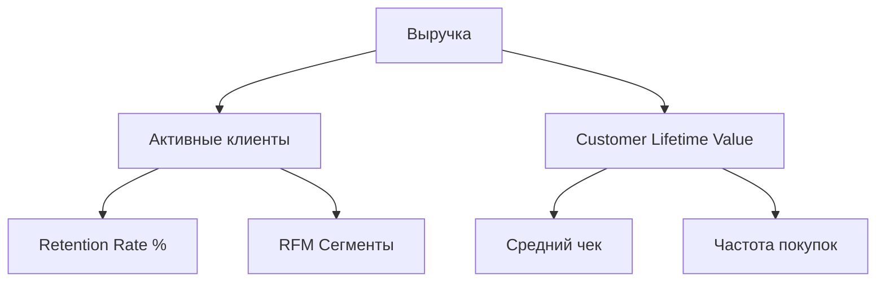

# 🚀 Retail Data Pipelines & Product Analytics Engine

Этот репозиторий представляет собой законченную аналитическую инфраструктуру для обработки транзакционных данных e-commerce, преобразования их в бизнес-витрины (Data Marts) и визуализации через интерактивный дашборд.

## 🏗️ Архитектура и стек технологий
*   **Data Engineering (ETL):** `Python`, `DuckDB` (высокопроизводительный SQL-движок), `Parquet` (колончатый формат хранения).
*   **Моделирование данных (SQL):** Сложные CTE, оконные функции (`OVER`, `PARTITION BY`, `NTILE`) для расчета когортного Retention и RFM-сегментации.
*   **Business Intelligence (BI):** `Streamlit`, `Plotly` для интерактивной визуализации.
*   **Product Research (Исследования):** `Statsmodels`, `SciPy` для проверки статистических гипотез и Bootstrap-оценок.

---

## 🌲 Дерево продуктовых метрик



---

## ⚙️ Инструкция по запуску

### 1. Настройка окружения
```bash
pip install -r requirements.txt
```

### 2. Запуск ETL-пайплайна (Сборка витрин данных)
Скрипт обрабатывает сырой CSV, выполняет аналитические SQL-запросы через DuckDB и сохраняет витрины в формате Parquet.
```bash
python etl/build_dwh.py
```
*(Ожидает наличие `raw_data.csv` в папке `data/`)*.

### 3. Запуск BI-дашборда
Запуск интерактивного приложения Streamlit для визуализации тепловых карт Retention и RFM-сегментации.
```bash
streamlit run dashboard/app.py
```

### 4. Просмотр продуктовых исследований (A/B тесты)
В папке `experiments/` находится `ab_testing.ipynb` со статистическим разбором поведения пользователей в разных регионах с использованием `statsmodels` и бутстрапа.

---

## 📈 Результаты для бизнеса
*   **Автоматизация Retention:** Созданы масштабируемые SQL-запросы для отслеживания здоровья когорт.
*   **Сегментация клиентов:** Реализован динамический RFM-скоринг для выделения «VIP-клиентов» и «Зоны риска», что позволяет проводить точечные CRM-кампании.
*   **Статистическая строгость:** Внедрен подход проверки гипотез (Hypothesis Testing) для валидации продуктовых изменений перед масштабированием.
